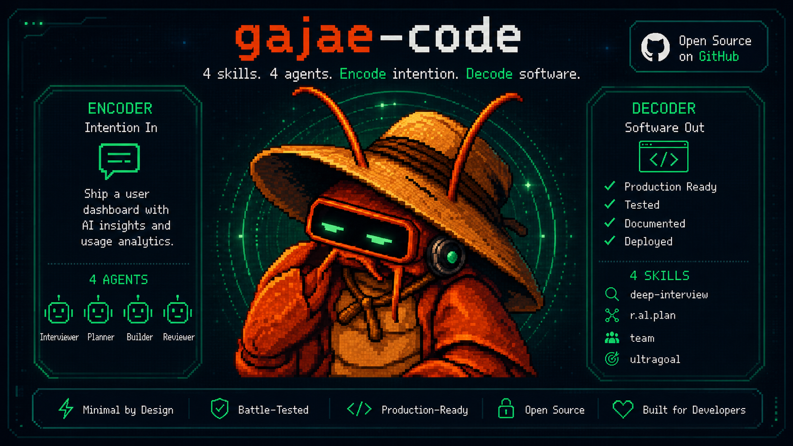

<p align="center">
  
</p>

# free-gjc-starter — 왕초보용 무료 AI 코딩 도우미 세팅

컴퓨터에 **무료로** AI 코딩 비서(`gjc`)를 깔아서 쓰는 가장 쉬운 방법입니다.
메인 두뇌는 **Gemini**(구글 계정으로 로그인만, 카드 등록 X), 나머지 일꾼들은 **무료 AI**로 돌아갑니다.

> **딱 3개만 하면 됩니다:** ① 프로그램 설치 → ② 무료 키 2개 받기 → ③ 구글 로그인.
> 컴퓨터 잘 몰라도 됩니다. 아래를 **순서대로 복사-붙여넣기**만 하세요.

> 📘 **그림 가이드(웹):** 👉 **<https://yazzang-homelab.github.io/free-gjc-starter/>** 를 그냥 클릭해서 여세요.
> (인터넷 없이 볼 거면 [`guide.html`](guide.html) 파일을 내려받아 더블클릭)

---

## 0. 준비물 (5분)

- **구글 계정** 하나 (Gmail 쓰면 있는 거예요)
- 인터넷 되는 **윈도우 PC** 또는 **맥**
- 그게 전부입니다. 돈 안 듭니다.

---

## 1. "터미널"부터 여는 법

터미널 = 컴퓨터에 **글자로 명령을 내리는 검은 창**입니다. 무섭지 않아요. 여기다 아래 명령들을 붙여넣을 겁니다.

### 🪟 윈도우
1. 키보드 왼쪽 아래 **⊞ 윈도우 키**를 누릅니다.
2. `터미널` 이라고 칩니다. (안 뜨면 `powershell` 이라고 치세요)
3. **`Windows Terminal`** 또는 **`Windows PowerShell`** 을 클릭 → 검은/파란 창이 뜹니다.

### 🍎 맥
1. 키보드에서 **`⌘(커맨드) + 스페이스바`** 를 동시에 누릅니다. (검색창이 뜸)
2. `터미널` 또는 `terminal` 이라고 칩니다.
3. **`터미널(Terminal)`** 을 눌러 엽니다.

> **복사-붙여넣기 방법**
> - 아래 회색 상자의 명령을 마우스로 드래그해 복사(`Ctrl+C`, 맥은 `⌘+C`).
> - 터미널 안에서 붙여넣기: 윈도우는 **마우스 오른쪽 클릭**, 맥은 **`⌘+V`**.
> - 붙여넣은 뒤 **엔터(Enter)** 를 눌러야 실행됩니다.

---

## 2. gjc 설치하기

터미널에 아래를 **한 줄씩 복사 → 붙여넣기 → 엔터** 하세요.

### 🪟 윈도우 (PowerShell 창에서)
```powershell
irm bun.sh/install.ps1 | iex
```
👉 끝나면 **창을 완전히 닫고, 터미널을 새로 여세요.** (설치한 게 반영되게)
새 창에서:
```powershell
bun install -g gajae-code
```

### 🍎 맥 / 리눅스
```bash
curl -fsSL https://bun.sh/install | bash
```
👉 끝나면 **터미널을 닫고 새로 여세요.** 새 창에서:
```bash
bun install -g gajae-code
```

✅ 잘 됐는지 확인 (`gjc` 버전 숫자가 나오면 성공):
```bash
gjc --version
```
> ❔ `gjc: command not found` 또는 `... 인식할 수 없습니다` 가 나오면 → 터미널을 완전히 닫고 다시 열어보세요. 그래도 안 되면 아래 **문제 해결**을 보세요.

---

## 3. 이 무료 세팅 설치하기

역시 터미널에 붙여넣으세요.

### 🪟 윈도우
```powershell
git clone https://github.com/yazzang-homelab/free-gjc-starter.git
cd free-gjc-starter
powershell -ExecutionPolicy Bypass -File .\install.ps1
```

### 🍎 맥 / 리눅스
```bash
git clone https://github.com/yazzang-homelab/free-gjc-starter.git
cd free-gjc-starter
bash install.sh
```
> ❔ `git: command not found` 이 나오면 → 윈도우는 <https://git-scm.com/download/win> 에서 Git 설치, 맥은 터미널에 `xcode-select --install` 입력 후 설치하고 다시 시도하세요.
> ❔ `이 시스템에서 스크립트를 실행할 수 없으므로` / `UnauthorizedAccess` 가 나오면 → 윈도우 기본 보안 정책이 `.ps1` 실행을 막는 겁니다. 위처럼 `powershell -ExecutionPolicy Bypass -File .\install.ps1` 로 실행하세요. (`.\install.ps1` 직접 실행은 정책을 풀어야만 됩니다.)

---

## 4. 무료 키 받기 (2~3개)

일꾼 AI들이 쓸 **무료 열쇠(API 키)** 를 받습니다. 카드 등록 필요 없어요.

| 어디서 | 링크 | 받을 것 | 언제 필요? |
| --- | --- | --- | --- |
| **OpenRouter** | <https://openrouter.ai/keys> | `sk-or-v1-...` | **항상** |
| **Groq** | <https://console.groq.com/keys> | `gsk_...` | **항상** |
| **NVIDIA NIM** | <https://build.nvidia.com/z-ai/glm-5.2> → **Get API Key** | `nvapi-...` | **방식 B 필수** / 방식 A는 선택(안정성↑) |

> **방식 A** = Gemini를 메인으로(구독 또는 무료 로그인) → OpenRouter·Groq 2개면 됨.
> **방식 B** = Gemini 안 쓰고 NVIDIA **GLM-5.2**를 메인으로 → NVIDIA 키까지 3개.
> (방식 A여도 Gemini가 막히면 자동으로 GLM-5.2로 넘어가므로 NVIDIA 키를 넣어두면 더 안정적)

각 사이트에서 **구글 계정으로 로그인 → "Create Key" 버튼 → 이름 아무거나 → 만들기 → 나온 키를 복사**하면 됩니다.
(버튼 위치까지 그림으로 보려면 [`guide.html`](guide.html) 참고)

> ⚠️ **키는 비밀번호 같은 거예요.** 남한테 보여주거나 파일에 저장하지 마세요. 아래처럼 터미널에만 넣습니다.

---

## 5. 받은 키를 컴퓨터에 넣기

아래에서 `여기에_복사한키_붙여넣기` 부분만 **방금 복사한 진짜 키로** 바꿔서 붙여넣으세요.

### 🪟 윈도우
```powershell
setx OPENROUTER_API_KEY "여기에_복사한키_붙여넣기"
setx GROQ_API_KEY "여기에_복사한키_붙여넣기"
setx NVIDIA_API_KEY "여기에_복사한키_붙여넣기"
```
👉 그리고 **터미널을 닫고 새로 여세요.** (`setx`는 새 창부터 적용돼요)

### 🍎 맥 / 리눅스
```bash
echo 'export OPENROUTER_API_KEY="여기에_복사한키_붙여넣기"' >> ~/.zshrc
echo 'export GROQ_API_KEY="여기에_복사한키_붙여넣기"' >> ~/.zshrc
echo 'export NVIDIA_API_KEY="여기에_복사한키_붙여넣기"' >> ~/.zshrc
source ~/.zshrc
```
> (오래된 맥/리눅스라 `zsh`가 아니면 `~/.zshrc`를 `~/.bashrc`로 바꿔 쓰세요.)

---

## 6. 메인 두뇌 정하기 (A 또는 B)

### 방식 A — Gemini를 메인으로 (로그인만, 키 없이)
터미널에 `free-gjc` 를 치고, `gjc` 화면이 뜨면 아래를 입력하고 엔터 → 브라우저에서 **본인 구글 계정으로 로그인**하세요.

> ⚠️ **로그인 전에 꼭 읽으세요.** 브라우저에 구글 계정을 **여러 개**(개인+회사/학교) 로그인해 두면, 로그인 창이 엉뚱한 조직(Workspace) 계정으로 인증돼 `GOOGLE_CLOUD_PROJECT ...` 오류가 납니다. **시크릿(인프라이빗) 창을 새로 열어 개인 지메일 1개만 로그인한 상태**에서 진행하거나, 회사 계정을 로그아웃하고 개인 계정만 남기세요.

```
/login google-antigravity
```

- **기본값이 이미 무료 Gemini(`google-antigravity/gemini-3.1-pro-low:high`)라, 위 로그인만 하면 바로 됩니다.** (설정 수정 불필요)
- **무료로 됩니다.** Google이 2026-06-18 옛 Gemini CLI 무료(Code Assist for individuals)를 종료하며 **무료 사용자를 Antigravity 무료티어로 이전**했습니다. 개인 Gmail이면 카드 등록 없이 **Gemini 3.1 Pro** 가 무료로 돌아갑니다(공식 public preview).
- ⚠️ **무료티어 할당량 주의.** preview라 하루 요청 수(대략 20 agent requests/day 수준)·몇 시간 단위 리셋·주간 상한이 있어, 많이 쓰면 금방 **`429`(한도 초과)** 가 납니다. 그땐 잠시 뒤 다시 쓰거나 **방식 B(NVIDIA GLM-5.2)**로 바꾸세요(폴백은 이미 자동). 무료는 preview 정책이라 영구 보장은 아닙니다.
- ℹ️ `google-antigravity`에서 **Opus 등 Anthropic/Claude 모델은 유료(구독) 전용**이라 무료 계정이 그걸 고르면 **404 (Requested entity was not found)** 가 납니다. 무료로는 기본값 **Gemini 3.1 Pro** 만 쓰세요. (옛 `/login google-gemini-cli` 무료 경로는 종료됨)

### 방식 B — Gemini 없이 NVIDIA GLM-5.2를 메인으로
로그인 필요 없이 **NVIDIA 키**(4번에서 발급)만 있으면 됩니다.
`~/.gjc-free/agent/config.yml` 을 열어 `default:` 줄을 이렇게 바꾸세요:
```yaml
modelRoles:
  default: nvidia-nim/z-ai/glm-5.2   # 메인 = 무료 GLM-5.2 (753B)
```
> 폴백 순서(Gemini → GLM-5.2)는 이미 들어있으니 `default` 한 줄만 바꾸면 끝입니다.

---

## 7. 진짜 되는지 확인 + 첫 대화

```bash
free-gjc -p --no-session "안녕? 넌 누구야?"
```
AI가 대답하면 **성공!** 🎉

이제 이렇게 씁니다:
```bash
free-gjc                                  # 대화형으로 켜기
free-gjc "파이썬으로 계산기 만들어줘"       # 한 번에 시키기
```
평소 쓰던 `gjc`(다른 프로필)와 **완전히 따로** 돌아가니 안심하세요.

---

## 문제 해결 (막히면 여기)

| 증상 | 해결 |
| --- | --- |
| `gjc: command not found` / `인식할 수 없습니다` | 터미널을 **완전히 닫고 새로** 여세요. 그래도면 2번 설치를 다시 하세요. |
| `git: command not found` | 3번 아래 안내대로 Git을 먼저 설치하세요. |
| AI가 `401` / `unauthorized` / `키 없음` 이라고 함 | 5번 키 입력을 다시 하고 **터미널을 새로** 여세요. 키를 잘못 복사했을 수 있어요. |
| **`Cloud Code Assist API error (404): Requested entity was not found`** | 로그인은 됐지만 **그 모델이 당신 계정 등급에 없는** 경우입니다. 무료 계정에서 **Opus 등 Anthropic/Claude(Antigravity 유료 전용) 모델**을 골랐을 때 대표적으로 납니다.<br>→ 무료면 `default:` 를 **`google-antigravity/gemini-3.1-pro-low:high`**(이 세팅 기본값)로 두세요. 무료티어는 Gemini 3.1 Pro만 됩니다.<br>다른 계정으로 잘못 로그인했으면 `free-gjc /logout` 후 개인 Gmail로 `/login google-antigravity` 재로그인. |
| AI가 `429` / `RESOURCE_EXHAUSTED` / `quota` | **Antigravity 무료티어 할당량 소진**(하루 요청 수·주간 상한, 몇 시간 뒤 리셋). 잠시 뒤 다시 쓰거나 방식 B(NVIDIA GLM-5.2)로 전환하세요. |
| `모델을 찾을 수 없음` / `no match` | 무료 모델 이름이 바뀐 겁니다. 아래 링크에서 유효한 이름을 찾아 `~/.gjc-free/agent/` 안의 `models.yml`·`config.yml`을 고치세요.<br>OpenRouter: <https://openrouter.ai/models?q=free> · Groq: <https://console.groq.com/docs/models> |
| Gemini 로그인 브라우저가 안 열림 | 터미널에 뜬 주소(링크)를 복사해 직접 브라우저 주소창에 붙여넣으세요. |
| `GOOGLE_CLOUD_PROJECT ... 환경변수를 설정해야` / `requires setting the GOOGLE_CLOUD_PROJECT` | **브라우저에 구글 계정을 여러 개 로그인해 두면** 로그인 창이 엉뚱한 회사/조직(Workspace) 계정으로 인증돼서 나는 오류입니다(개인 계정으로 로그인해도 발생). 해결: **시크릿/인프라이빗 창**을 새로 열고 **개인 지메일 1개만** 로그인한 상태에서, 터미널에 뜬 로그인 주소를 그 창에 붙여넣으세요. (또는 브라우저에서 회사/조직 계정을 전부 로그아웃하고 개인 계정만 남긴 뒤 재시도.) 그래도 안 되면 방식 B(NVIDIA GLM-5.2)로 쓰세요. |
| **`Provider stream timed out while waiting for the first event`** / `... stalled while waiting for the next event` | 무료 티어 모델이 **첫 토큰을 늦게 뱉어서**(추론 모델 + 대기열 + 긴 대화) gjc의 스트림 감시 타이머에 걸린 겁니다. 최신 `free-gjc` 런처는 이 타이머를 넉넉하게(첫 응답 10분 / 유휴 5분) 잡아두니 **repo를 `git pull` 후 3번 설치를 다시 실행**하세요. 그래도 나면 대화가 너무 길어진 것 — `/compact` 로 컨텍스트를 줄이거나 새 세션으로 시작하세요. |

> 🗨️ **혼자 해결 안 되면** — 오픈카톡으로 물어보세요: **<https://open.kakao.com/o/pW7JOXDi>**
> (이 세팅 올린 사람이 직접 답변합니다. gjc 원작자와는 무관해요 ㅎㅎ)

---

## 안심하세요 (개인정보/보안)

- 이 repo와 `guide.html` 어디에도 **API 키·개인정보가 없습니다.** 설정 파일은 키의 *이름*만 참조합니다.
- 당신의 키는 **당신 PC에만** 저장됩니다. 남과 공유할 땐 이 repo 주소만 주면 되고, 각자 자기 키를 넣습니다.
- 기존에 쓰던 `gjc` 설정은 **건드리지 않습니다.** 이 세팅은 `~/.gjc-free` 폴더에만 들어갑니다.

## 무엇을 쓰는지 (참고)

| 역할 | 모델 | 조달 |
| --- | --- | --- |
| 메인(default) | Gemini(방식 A) / GLM-5.2(방식 B) | 구글 로그인 또는 NVIDIA 키 |
| executor·architect | Nemotron 3 Super 120B (무료) | OpenRouter 키 |
| planner | Llama 3.3 70B (무료) | Groq 키 |
| critic | Llama 3.1 8B Instant (무료) | Groq 키 |

메인은 **Gemini 1순위 → NVIDIA GLM-5.2 2순위**로 자동 폴백. 서브에이전트 무료 모델이 멈추면 다른 무료 → 마지막엔 GLM-5.2로 전환됩니다.

## 파일 구성 (개발자용)

| 경로 | 설치 위치 | 용도 |
| --- | --- | --- |
| `agent/config.yml` | `~/.gjc-free/agent/config.yml` | 역할 매핑 + 폴백 |
| `agent/models.yml` | `~/.gjc-free/agent/models.yml` | 무료 provider 정의 (키는 env 이름만) |
| `bin/free-gjc`, `.cmd`, `.ps1` | PATH | `free-gjc` 실행기 (프로필 격리) |
| `install.sh` / `install.ps1` | — | 설치 스크립트 |
| `guide.html` | — | 그림 포함 키 발급 가이드 |

---

## ☕ 후원

이 가이드가 도움이 됐다면 **커피 한잔** 부탁드립니다 ㅎㅎ

<p align="center">
  <a href="https://emulog.app/donate.html"><b>☕ 커피 한잔 후원하기</b></a>
</p>

> 후원은 emulog.app 후원 페이지로 연결됩니다. (이 repo에는 계좌·결제 정보가 저장돼 있지 않습니다.)

---

## 🦞 원작 gjc (gajae-code)

이 세팅은 **gajae-code(gjc)** 위에서 동작합니다. gjc 본체·가재 캐릭터의 원작자와 프로젝트:

- 원작 프로젝트: **<https://github.com/Yeachan-Heo/gajae-code>**
- 원작자: **[@Yeachan-Heo](https://github.com/Yeachan-Heo)**

> 이 repo는 gjc를 무료로 쉽게 쓰기 위한 **비공식 초보자 세팅**일 뿐이며, gjc 본체는 위 원작 프로젝트의 것입니다. 가재 이미지도 원작 저장소의 에셋입니다.
